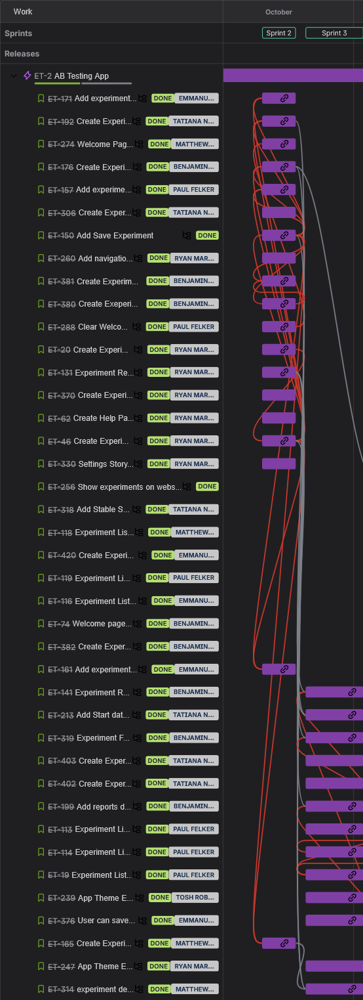
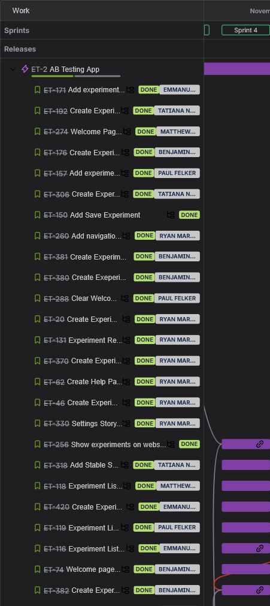
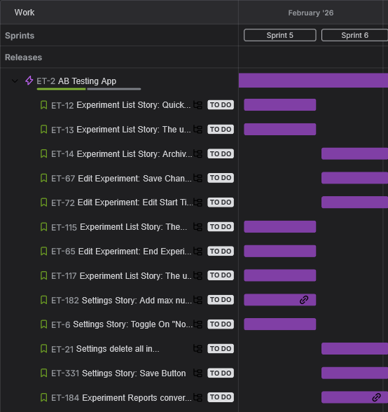
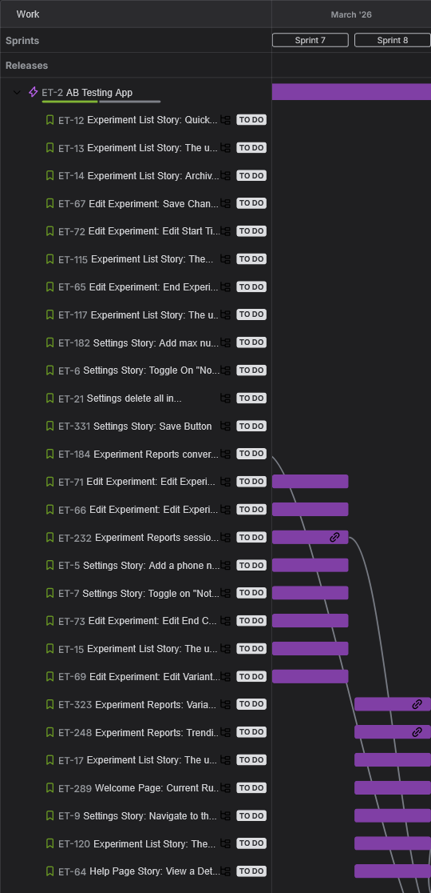
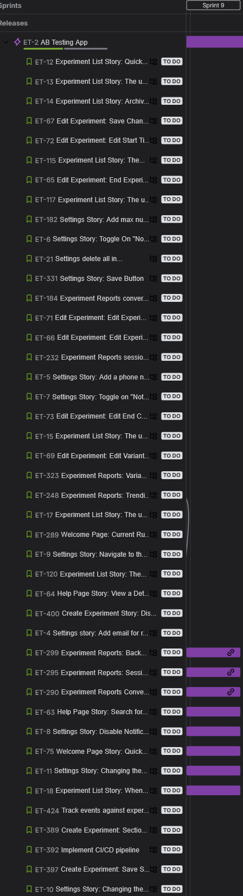
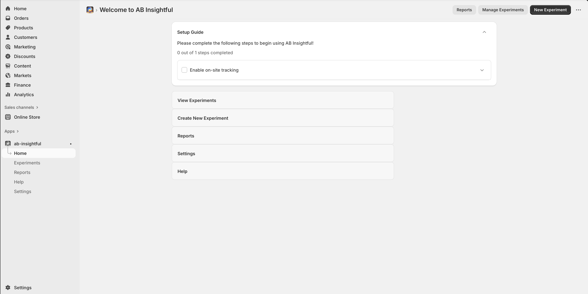
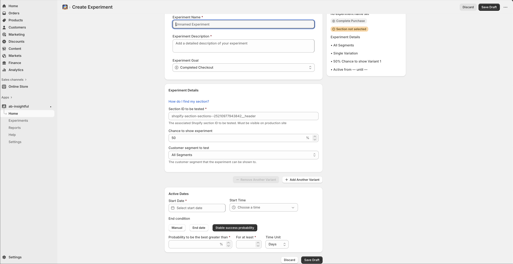
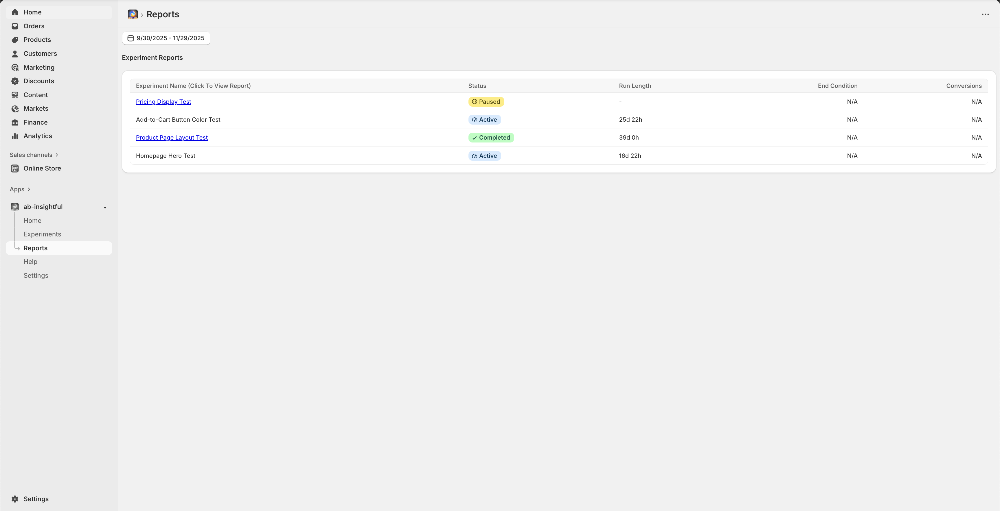
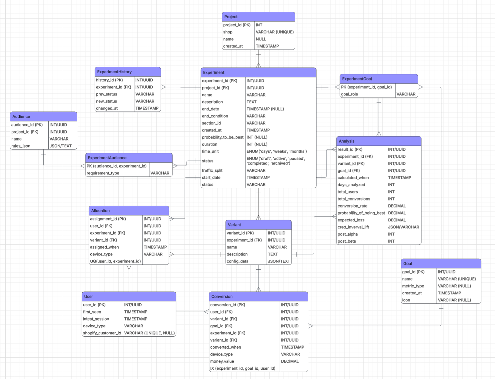

# AB Insightful 
## Synopsis


Ab-Insightful helps Shopify merchants analyze customer engagement and customer conversion. AB-Insightful is unique from other A/B testing platforms because it is the first completely native-to-Shopify solution on the market that still offers robust customer tracking and insights. Our product utilizes Shopify’s theme extensions and Polaris Web Components Library to give merchants a familiar user interface and process for creating and deploying alternative websites that can be used for A/B testing. A core feature of our application is robust reporting. Merchants who install our app are able to view metrics such as conversion rates through intuitive UI and easy to read reports.

## Product Features
- [ ] Administrator interface – _Easily navigable interface that adheres to shopify style conventions.  Contains important links and all necessary information for using the product effectively_
- [ ] Built in app – _Easily downloadable and connectable with any shopify store_
- [ ] Core AB testing algorithm – _On site customer behavior tracking, allowing the user to see site visitors and track key events to help determine success of experiment _
- [ ] Reporting features  – _Statistical analysis, insights and experiment level reports help the user to gauge experiment success.  Users are able to see experiment status, modify experiments and view experiment progress_
- [ ] Database features – _Includes the ability to store experiment data, customer tracking data and performance metrics for later access


## Project Timeline
Sprint
Dates
Milestone
Description
Sprint 1
10/1-10/12
Client Discovery & Figma Design
Assembled a team of developers and found a client for a job. Designed UI. 
Sprint 2
10/13 - 10/19
Initial Epic Planning & Environment Setup
Creation of initial user stories and development environment for programming
Sprint 3
10/22 - 11/02
Database Testing Environment & Experiment Creation Table
Created programmatic infrastructure for Seeding and experiment creation page functionality. 
Sprint 4
11/06 - 11/16
Reporting Calculation & Reporting
Reporting calculation and polish.
Sprint 5
02/02-02/15
Database Integration with Front-end
Completes frontend display of relevant experiment list & reporting data from the database
Sprint 6
02/17-03/01
Reporting Data graphing and database seeding
Finalization of Report Graphing. Additional database seeding for depicting graphing
Sprint 7
03/03-03/15
Settings Page & Experiment Distribution to Customers. 
Completion of Settings page and necessary additional user interaction features. Experiment distribution to customers and associated data tracking completed. 
Sprint 8
03/17-03/29
Bug testing & Stretch Features
Creation of Unit tests and bug fixes. Add A/B/C Testing.
Sprint
9
03/31-04/12
Stretch Features, Bug testing
Additional Unit tests and bug fixes. Creation of Conversion full report.

Sprint 2 & 3

Sprint 4


Sprint 5 & 6



Sprint 7 & 8


Sprint 9 


## Developer Instructions
Will provide development insight in greater detail during CSC 191. 
### Prerequisites
Before you begin, you'll need the following:
Node.js: Download and install it if you haven't already.
Shopify Partner Account: Create an account if you don't have one.
Test Store: Set up either a development store or a Shopify Plus sandbox store for testing your app.
Shopify CLI: Download and install it if you haven't already.
npm install -g @shopify/cli@latest
If you are on MacOS or linux, you may need to add "sudo" in front of the above command.

### Setup
```bash
# Clone the repository
git clone https://github.com/AB-Insightful/ab-insightful.git

# Navigate to project directory
cd <project-directory>

# Install dependencies
npm install
```
Additional libraries for statistical calculation and remix actions
run npm install @stdlib/random-base-beta (for calculating probability of best) run npm install @remix-run/node (for activating actions in jsx)
Also, be sure to to migrate the schema changes to the database as stated above

### Building

Build the app by running the command below with the package manager of your choice:
Using yarn:
`yarn build`
Using npm:
`npm run build`
Using pnpm:
`pnpm run build`

### Testing
_Include steps for running automated or manual tests._

```bash
# Run unit tests
npm test
```
_Add any test coverage notes or frameworks used (e.g., Jest, Mocha)._
### Deploying
Will further describe how to deploy the project (e.g., using Docker, Shopify App CLI, or cloud provider setup). Placeholder for deployment instructions until completion of CSC 191.

## Product Design









## Database
_The database is capable of storing experiment data, analysis of the experiment, and relevant user and cookie data. Experiment data is used to track the current experiment, the relevant changes between the main and base cases, and settings for end condition, status, and more.  During the runtime of the experiment, specified goal data is stored to help calculate the analysis of the data.  This is able to determine if the experiment variant is successful or detrimental.  Finally, users and their relevant cookie data are stored to store if they are a part of the experiment, if they are a part of the base or variant, and if they complete the specified goal._



---
## Contributors
| Name     | Role                 | GitHub      |
| -------- | -------------------- | ----------- |
| _Benjamin Church_ | _Full Stack / Graphic Designer_ | _@ChurchDuck1_ |
| _Emmanuel Rodriguez_ | _Full Stack_  | _@HeadlessChickenFajita_ | _ @melRodCSUS_ |
| _Matthew Tagintsev_ | _Full Stack_    | _@tagintsevm_ |
| _Paul Felker_ | _Full Stack_    | _@pfelker13_ |
| _Ryan Martinez_ | _Architecture / Backend_    | _@ryanmart25_ |
| _Tatiana Neville_ | _Project Manager / Full Stack_    | _@RicePaperDolls_ |
| _Tosh Brockway Roberts_ | _Technical Lead / Full Stack_    | _@toshrb_ |
---
